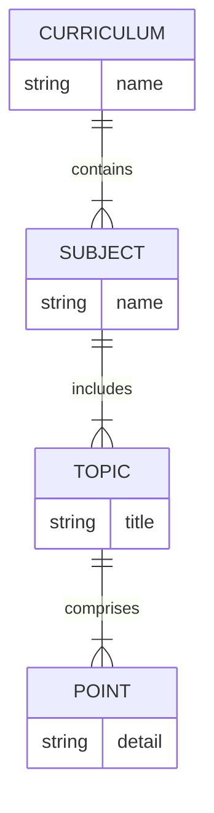

# eLearning API v1 – TypeScript SDK

Install
```bash
npm i @genixsuitecom/elearning-sdk
```

Rename `.env.example` to `.env`
Enter `.env` variables from https://app.genixsuite.com/settings/api
  - Create a client
  - Name the client and select the scope
  - Copy client ID and client secret to the .env file

OAuth quickstart

Client Credentials grant (server-to-server):
```ts
import { ElearningApiClient } from '@genixsuitecom/elearning-sdk'

async function getClientCredentialsToken() {
  const url = 'https://app.genixsuite.com/api/oauth2/token'
  const body = new URLSearchParams({
    grant_type: 'client_credentials',
    scope: 'jobs:read',
    client_id: process.env.GENIXSUITE_CLIENT_ID!,
    client_secret: process.env.GENIXSUITE_CLIENT_SECRET!,
  })
  const res = await fetch(url, {
    method: 'POST',
    headers: { 'Content-Type': 'application/x-www-form-urlencoded' },
    body,
  })
  if (!res.ok) throw new Error(`token error: ${res.status}`)
  const json = await res.json() as { access_token: string }
  return json.access_token
}

const token = await getClientCredentialsToken()
const client = new ElearningApiClient({
  baseUrl: 'https://app.genixsuite.com',
  token,
  verbose: true,            // optional logging
  validateResponses: false, // optional Zod validation
})
```

## Elite Quickstart (PowerShell – Windows)

Prereqs
- OAuth client with scopes you need: `jobs:write jobs:read artifacts:read ingest:write curriculums:write`
- Base URL: `https://app.genixsuite.com`

PowerShell session setup
```powershell
$BASE = "https://app.genixsuite.com"
$CLIENT_ID = "ci_xxx"
$CLIENT_SECRET = "cs_xxx"
$SCOPE = "jobs:write jobs:read artifacts:read ingest:write curriculums:write"

# Get access token (Client Credentials)
$TOKEN = (curl -s -X POST "$BASE/api/oauth2/token" `
  -H "Content-Type: application/x-www-form-urlencoded" `
  -d "grant_type=client_credentials&client_id=$CLIENT_ID&client_secret=$CLIENT_SECRET&scope=$SCOPE" | ConvertFrom-Json).access_token

# Helpers
$IDEMP = [guid]::NewGuid().ToString()
$Headers = @{ "Authorization" = "Bearer $TOKEN" }
```

1) Create a curriculum
```powershell
curl -s -X POST "$BASE/api/v1/curriculums" `
  -H "Authorization: Bearer $TOKEN" `
  -H "Content-Type: application/json" `
  -d '{"title":"Demo Curriculum"}' | ConvertFrom-Json
```

2) List curriculums
```powershell
curl -s -X GET "$BASE/api/v1/curriculums" -H "Authorization: Bearer $TOKEN" | ConvertFrom-Json
```

3) Get a specific curriculum
```powershell
curl -s -X GET "$BASE/api/v1/curriculums/<curriculumId>" -H "Authorization: Bearer $TOKEN" | ConvertFrom-Json
```

4) Subjects: create + process (single-call orchestration)
```powershell
$body = @{
  subject = @{ title = "House Committees" }
  sources = @(@{ url = "https://clerk.house.gov/committee_info/scsoal.pdf" })
  outputs = @("pptx","pdf")
} | ConvertTo-Json

$resp = curl -s -X POST "$BASE/api/v1/subjects/process" `
  -H "Authorization: Bearer $TOKEN" `
  -H "Content-Type: application/json" `
  -H "Idempotency-Key: $IDEMP" `
  -d $body | ConvertFrom-Json

$JOB = $resp.jobId
$JOB
```

5) Exports: create export job (subjectId OR curriculumId)
```powershell
# From subjectId
$body = @{ subjectId = "$JOB"; outputs = @("pptx","pdf") } | ConvertTo-Json
$resp = curl -s -X POST "$BASE/api/v1/exports" `
  -H "Authorization: Bearer $TOKEN" `
  -H "Content-Type: application/json" `
  -d $body | ConvertFrom-Json
$JOB = $resp.jobId

# From curriculumId
$body = @{ curriculumId = "<curriculumId>"; outputs = @("pptx") } | ConvertTo-Json
$resp = curl -s -X POST "$BASE/api/v1/exports" `
  -H "Authorization: Bearer $TOKEN" `
  -H "Content-Type: application/json" `
  -d $body | ConvertFrom-Json
$JOB = $resp.jobId
```

6) Jobs: status and cancel (idempotent)
```powershell
# Status
curl -s "$BASE/api/v1/jobs/$JOB" -H "Authorization: Bearer $TOKEN" | ConvertFrom-Json

# Cancel
$IDEMP2 = [guid]::NewGuid().ToString()
curl -i -X POST "$BASE/api/v1/jobs/$JOB/cancel" `
  -H "Authorization: Bearer $TOKEN" `
  -H "Idempotency-Key: $IDEMP2"
```

7) Artifacts: list (ETag) and resolve download URL
```powershell
# List artifacts (200)
$arts = curl -s "$BASE/api/v1/jobs/$JOB/artifacts" -H "Authorization: Bearer $TOKEN" | ConvertFrom-Json
$ARTIFACT = $arts.items[0].id

# (Optional) capture ETag for conditional GET
$ETAG = (curl -sI "$BASE/api/v1/jobs/$JOB/artifacts" -H "Authorization: Bearer $TOKEN" | Select-String '^ETag:' | ForEach-Object { $_.Line.Split(':',2)[1].Trim() })
if ($ETAG) {
  curl -i "$BASE/api/v1/jobs/$JOB/artifacts" -H "Authorization: Bearer $TOKEN" -H "If-None-Match: $ETAG"
}

# Resolve download URL
curl -s "$BASE/api/v1/artifacts/$ARTIFACT" -H "Authorization: Bearer $TOKEN" | ConvertFrom-Json
```

8) Ingest (canonical prefix)
```powershell
# 1) Presign upload
$sha = "aaaaaaaaaaaaaaaaaaaaaaaaaaaaaaaaaaaaaaaaaaaaaaaaaaaaaaaaaaaaaaaa"  # 64 hex
$body = @{ filename = "doc.pdf"; mimeType = "application/pdf"; sizeBytes = 123456; sha256 = $sha } | ConvertTo-Json
$IDEMP3 = [guid]::NewGuid().ToString()
$upload = curl -s -X POST "$BASE/api/v1/ingest/uploads" `
  -H "Authorization: Bearer $TOKEN" `
  -H "Content-Type: application/json" `
  -H "Idempotency-Key: $IDEMP3" `
  -d $body | ConvertFrom-Json
$S3URL = $upload.uploadUrl
$FIELDS = $upload.fields
$SOURCE_ID = $upload.sourceId

# 2) Upload to S3 using returned form fields (adjust according to returned keys)
Invoke-RestMethod -Method Post -Uri $S3URL -Form @{
  "key"              = $FIELDS.key
  "policy"           = $FIELDS.policy
  "x-amz-algorithm"  = $FIELDS."x-amz-algorithm"
  "x-amz-credential" = $FIELDS."x-amz-credential"
  "x-amz-date"       = $FIELDS."x-amz-date"
  "x-amz-signature"  = $FIELDS."x-amz-signature"
  "Content-Type"     = "application/pdf"
  "file"             = Get-Item .\doc.pdf
}

# 3) Register the uploaded source
$body = @{ sourceId = $SOURCE_ID; filename = "doc.pdf"; mimeType = "application/pdf"; sizeBytes = 123456; sha256 = $sha } | ConvertTo-Json
$IDEMP4 = [guid]::NewGuid().ToString()
curl -s -X POST "$BASE/api/v1/ingest/sources" `
  -H "Authorization: Bearer $TOKEN" `
  -H "Content-Type: application/json" `
  -H "Idempotency-Key: $IDEMP4" `
  -d $body | ConvertFrom-Json
```

Optional debug (if enabled by your deployment)
```powershell
curl -s -H "Authorization: Bearer $TOKEN" "$BASE/api/v1/_debug/whoami"
curl -s -H "Authorization: Bearer $TOKEN" "$BASE/api/v1/_debug/ping"
```

## Idempotency and ETag cheat‑sheet

- Idempotent POSTs support `Idempotency-Key` header. Replaying with the same key and identical body returns the original result with `Idempotency-Replayed: true`. Replaying with a different body returns `409 Conflict`.
- Artifacts list supports ETag. First call returns `ETag` header. Send `If-None-Match: <etag>` for efficient polling; server returns `304 Not Modified` if unchanged.

## Troubleshooting

| Symptom | Likely cause | What to do |
|---|---|---|
| 401 Unauthorized | Missing/expired token; wrong audience/issuer | Re-fetch token from `$BASE/api/oauth2/token`; ensure `aud=elearning-api` and clock is correct |
| 403 Forbidden | Missing scope or tenant mismatch | Add required scope(s) to your client; ensure resource belongs to your client |
| 404 Not Found | Endpoint not deployed (e.g., `/api/v1/subjects/process`); wrong ID | Verify the route exists in your environment; check IDs |
| 409 Conflict | Idempotency body mismatch; AV pending/failed | Reuse same body for same `Idempotency-Key`; wait for AV scan or fix input |
| 413 Payload Too Large | File too big during ingest | Lower `sizeBytes` or upload a smaller file |
| 429 Rate limit | Too many requests | Back off and retry with jitter |
| 304 Not Modified | Conditional GET matched | Use cached response; no change detected |
| TLS/DNS errors | Firewall, proxy, or wrong base URL | Verify `$BASE`, corporate proxy settings, and outbound access |

Tip: On corporate Windows networks with system proxies, native Node fetch does not use proxies by default. Run `npx elearning-sdk doctor` for diagnostics and proxy hints.

## Scopes per endpoint (summary)

- `/api/v1/subjects/process`: `jobs:write`
- `/api/v1/exports`: `jobs:write`
- `/api/v1/jobs/{id}` (GET): `jobs:read`
- `/api/v1/jobs/{id}/cancel` (POST): `jobs:write`
- `/api/v1/jobs/{id}/artifacts` (GET): `artifacts:read`
- `/api/v1/artifacts/{id}` (GET): `artifacts:read`
- `/api/v1/ingest/*` (POST): `ingest:write`
- `/api/v1/curriculums*`: `curriculums:write` for create, `jobs:read` not required for list/get

## Canonical ingest prefix

Ingest endpoints are under `/api/v1/ingest/*`.

## Run the TypeScript examples (local)

Requirements
- Node 18+ (global `fetch` available)
- Optional: `tsx` or `ts-node` to run `.ts` directly

Environment
- `GENIXSUITE_BASE=https://app.genixsuite.com`
- `GENIXSUITE_API_TOKEN=<bearer>` (or `GENIXSUITE_CLIENT_ID`/`GENIXSUITE_CLIENT_SECRET` + `GENIXSUITE_SCOPES`)

Run
```bash
# with tsx
npx tsx examples/quickstart.ts

# or with ts-node (ESM)
node --loader ts-node/esm examples/quickstart.ts
```

The examples log verbosely with sensitive fields redacted and surface RFC7807 problem details on errors.

Refresh Token grant:
```ts
async function refreshAccessToken(refreshToken: string) {
  const url = 'https://app.genixsuite.com/api/oauth2/token'
  const body = new URLSearchParams({
    grant_type: 'refresh_token',
    refresh_token: refreshToken,
  })
  const res = await fetch(url, {
    method: 'POST',
    headers: { 'Content-Type': 'application/x-www-form-urlencoded' },
    body,
  })
  if (!res.ok) throw new Error(`refresh error: ${res.status}`)
  return res.json() as Promise<{ access_token: string; refresh_token?: string }>
}
```

Usage
```ts
import { ElearningApiClient } from '@genixsuitecom/elearning-sdk'

// Option A: static bearer token (e.g., client_credentials or SSO access token)
const client = new ElearningApiClient({
  baseUrl: 'https://app.genixsuite.com',
  token: process.env.GENIXSUITE_API_TOKEN!,
  verbose: true,            // logs method/url/status with redacted headers
  validateResponses: true,  // Zod-validate responses at runtime
  requestInterceptors: [    // optional request interceptors
    ({ url, init }) => ({ url, init }),
  ],
  responseInterceptors: [],
})

// Option B: async token resolver (rotate/refresh as needed)
// const client = new ElearningApiClient({
//   baseUrl: 'https://app.genixsuite.com',
//   token: async () => process.env.GENIXSUITE_API_TOKEN!,
// })

// Step 1: presign upload
const upload = await client.createUpload({ filename: 'doc.pdf', mimeType: 'application/pdf', sizeBytes: 1024, sha256: '...' }, 'idem-123')

// Step 2: register source
await client.registerSource({ sourceId: upload.sourceId, filename: 'doc.pdf', mimeType: 'application/pdf', sizeBytes: 1024, sha256: '...' }, 'idem-123')

// Optional: create a curriculum (first-class entity)
const { curriculumId } = await client.createCurriculum({
  title: 'Onboarding Training v1',
  description: 'New hire onboarding curriculum'
})

// Single-POST orchestration (creates subject and starts export job)
// Associate the subject to a curriculum by passing curriculum_id
const job = await client.processSubject({
  subject: { title: 'Safety Training' },
  curriculum_id: curriculumId,
  sources: [{ sourceId: upload.sourceId }],
  outputs: ['pptx', 'pdf']
}, 'idem-456')

// Export from existing subject (supports all output types: pptx, pdf, jira, confluence, image, video)
const exportJob = await client.createExport({
  subjectId: '550e8400-e29b-41d4-a716-446655440000',
  outputs: ['pptx', 'pdf', 'jira'],
  options: { includeImages: true }
})

// Poll job status
const status = await client.getJob(exportJob.jobId)

// List artifacts when job completes
const artifacts = await client.listJobArtifacts(exportJob.jobId)

// Download artifact
const link = await client.getArtifact(artifacts.items[0].id)
```

Advanced options

- `validateResponses`: When true, responses are parsed/validated with Zod schemas. Throws on shape mismatch.
- `verbose`: Adds request/response interceptors that log method, URL, status with sensitive headers redacted.
- `requestInterceptors` / `responseInterceptors`: Provide arrays of interceptor functions to observe/mutate requests and observe responses.
- Interceptors (advanced): You can also attach interceptors directly to the generated client:
  ```ts
  import { OpenAPI, type RequestInterceptor, type ResponseInterceptor } from '@genixsuitecom/elearning-sdk'
  const req: RequestInterceptor = ({ url, init }) => ({ url, init })
  const res: ResponseInterceptor = ({ response }) => { /* metrics */ }
  OpenAPI.INTERCEPTORS = { request: [req], response: [res] }
  ```

Environment and settings

- base URL: `https://app.genixsuite.com` (production)
- issuer: `https://app.genixsuite.com`
- audience: `elearning-api`
- token endpoint: `https://app.genixsuite.com/api/oauth2/token`
- access tokens are short-lived; use refresh or client credentials for server jobs

Note: The domain `learn.genixsuite.com` may be used for specific partner integrations or staging environments. Use `app.genixsuite.com` for standard API access.

Notes

- Enable `verbose: true` to get debug logs with sensitive fields redacted.
